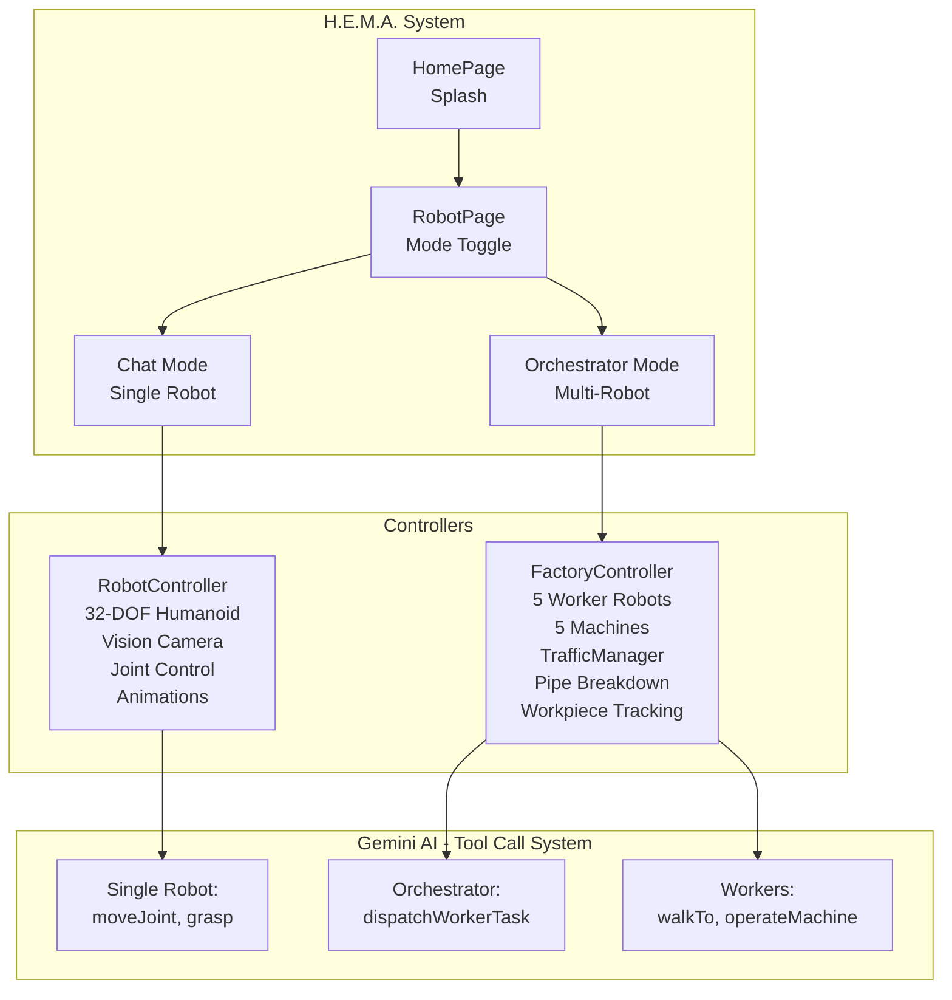
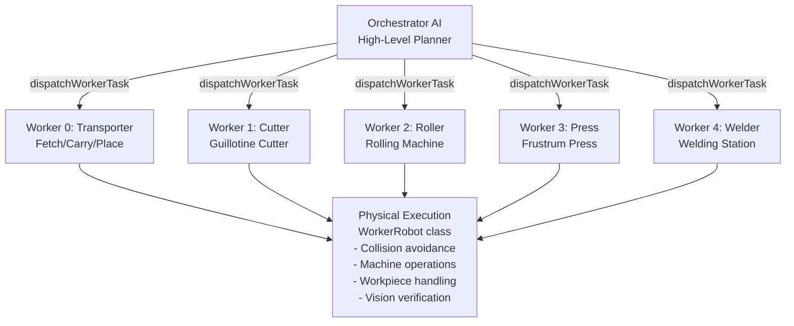

# H.E.M.A. - Humanoid Embodiment of Multimodal AI


An intelligent humanoid robot simulation powered by Google Gemini AI with 32 articulated joints, real-time vision, and multi-agent factory orchestration.

## Table of Contents

- [Project Overview](#project-overview)
- [Key Features](#key-features)
- [Technology Stack](#technology-stack)
- [Architecture](#architecture)
- [Installation](#installation)
- [Usage](#usage)
- [Project Structure](#project-structure)
- [Development](#development)
- [Deployment](#deployment)

## Project Overview

H.E.M.A. demonstrates LLM control of physical systems through tool calls, vision perception, and autonomous decision-making.

**Two Operating Modes:**

1. **Chat Mode** - Natural language control of a single humanoid robot with first-person vision, gestures, and object manipulation
2. **Factory Mode** - Multi-agent orchestration of 5 worker robots in an automated pipe manufacturing facility with collision avoidance

## Key Features

- ✅ **32-DOF Humanoid Robot** - Fully articulated with realistic proportions
- ✅ **First-Person Vision System** - AI can see and reason about its environment
- ✅ **Natural Language Control** - Command robots using plain English via Gemini AI
- ✅ **Gesture System** - Wave, greet, point, and custom animations
- ✅ **Object Manipulation** - Grasp and release 7 different objects
- ✅ **Multi-Robot Orchestration** - Coordinate 5 worker robots simultaneously
- ✅ **Factory Automation** - Complete pipe manufacturing pipeline (cut, roll, press, weld)
- ✅ **Collision Avoidance** - TrafficManager prevents robot collisions
- ✅ **Real-Time 3D Rendering** - Smooth 60 FPS visualization with Three.js
- ✅ **Dual Camera System** - Third-person view + first-person robot vision
- ✅ **TypeScript Type Safety** - Full type coverage with strict mode

## Technology Stack

| Category | Technology | Purpose |
|----------|-----------|---------|
| **Runtime** | Bun 1.3.5+ | All-in-one JavaScript runtime with hot reload |
| **UI Framework** | React 19 | Component-based UI with hooks |
| **Language** | TypeScript | Full type safety with strict compilation |
| **3D Graphics** | Three.js 0.182.0 | WebGL-based 3D rendering engine |
| **AI/LLM** | Google Gemini API | Tool-based AI control and decision-making |
| **Build Tool** | Bun | Fast bundling and development server |

## Architecture

### System Overview



### Data Flow

**Chat Mode:**
User message → Gemini AI → Tool calls → RobotController → Results → AI response

**Factory Mode:**



### Scene Layout

**Chat Mode:** Third-person + first-person cameras, 32-DOF humanoid, 7 graspable objects on table

**Factory Mode:** 6 machines on X-axis (-12 to 18), 5 worker robots, pipe rack, corridor at Z=8 for navigation

## Installation

**Requirements:** Bun 1.3.5+, WebGL 2.0 browser, Gemini API key ([get free key](https://aistudio.google.com/apikey))

```bash
# Install dependencies
bun install

# Create .env file
echo GEMINI_API_KEY=your-key-here > .env

# Start development server
bun dev
```

Open http://localhost:3000


## Project Structure

```
proj/
├── src/
│   ├── index.html              # Entry HTML file
│   ├── index.ts                # Bun server + API routes
│   ├── frontend.tsx            # React root mounting
│   ├── index.css               # Global styles
│   ├── App.tsx                 # State-based routing (home/robot)
│   │
│   ├── api/                    # Gemini AI Integration
│   │   ├── gemini.ts          # GeminiSession class (single robot)
│   │   ├── orchestrator.ts    # OrchestratorSession (factory planner)
│   │   └── workerAI.ts        # WorkerSession (individual worker AI)
│   │
│   ├── robot/                  # Single Robot Implementation
│   │   ├── RobotController.ts # Main controller (273 lines)
│   │   ├── createRobot.ts     # 32-DOF humanoid mesh (626 lines)
│   │   ├── createScene.ts     # Scene, lights, camera (255 lines)
│   │   ├── animations.ts      # Joint movement, gestures, walk cycle
│   │   ├── types.ts           # Joint names, limits, constants
│   │   └── index.ts           # Module exports
│   │
│   ├── factory/                # Multi-Robot Factory System
│   │   ├── FactoryController.ts    # Main orchestration engine
│   │   ├── WorkerRobot.ts          # Individual worker implementation
│   │   ├── TrafficManager.ts       # Collision avoidance system
│   │   ├── createFactoryScene.ts   # Factory environment setup
│   │   ├── factoryAnimations.ts    # Machine operation animations
│   │   ├── types.ts                # Factory types (specs, steps)
│   │   ├── pipeBreakdown.ts        # Pipe spec → manufacturing steps
│   │   ├── pipeValidator.ts        # Pipe specification validation
│   │   ├── materials.ts            # Shared material definitions
│   │   ├── helpers.ts              # Utility functions
│   │   │
│   │   └── machines/                # Individual Machine Implementations
│   │       ├── createMetalSheetStock.ts    # Raw material storage
│   │       ├── createGuillotineCutter.ts   # Sheet cutting machine
│   │       ├── createRollingMachine.ts     # 3-roller pipe bender
│   │       ├── createFrustrumPress.ts      # Conical section press
│   │       ├── createWeldingStation.ts     # Longitudinal welder
│   │       ├── createPipeRack.ts           # Finished product storage
│   │       └── index.ts                    # Machine exports
│   │
│   ├── context/                # React Context Providers
│   │   ├── RobotContext.tsx    # RobotController provider & useRobot hook
│   │   └── FactoryContext.tsx  # FactoryController provider & useFactory hook
│   │
│   ├── components/             # React UI Components
│   │   ├── ChatPanel.tsx       # Chat input + message history
│   │   ├── ChatMessage.tsx     # Individual message rendering
│   │   ├── VisionFeed.tsx      # Robot first-person camera display
│   │   ├── ModeToggle.tsx      # Chat/Orchestrator mode switcher
│   │   ├── PipeSpecForm.tsx    # Pipe specification editor
│   │   ├── SegmentEditor.tsx   # Pipe segment detail editor
│   │   └── OrchestrationStatus.tsx # Factory status display
│   │
│   └── pages/                  # Page Components
│       ├── HomePage.tsx        # Landing page
│       ├── RobotPage.tsx       # Single robot mode layout
│       └── OrchestratorView.tsx # Factory orchestration layout
│
├── .env.example               # Environment variable template
├── .env                       # Your API key (create this, gitignored)
├── .gitignore                 # Git ignore rules
├── package.json               # Dependencies and scripts
├── bun.lock                   # Bun lock file
├── bunfig.toml                # Bun configuration
├── tsconfig.json              # TypeScript configuration
└── README.md                  # This file
```

## Usage

### Chat Mode

**Natural Language:** "Wave at me", "What do you see?", "Pick up the sphere"

**Manual Controls:** Use sliders and buttons for direct joint control and gestures

**Camera:** Mouse drag to orbit, wheel to zoom, right-click to pan

### Factory Mode

Define pipe specs with segments (cylinder/frustrum), submit to orchestrator, watch 5 workers autonomously manufacture pipes through cutting, rolling, pressing, and welding stations.


## Development

### Design Decisions

- **Raw Three.js** (not @react-three/fiber) for precise control and better performance
- **Server-side AI** keeps API key secure, client executes tools safely
- **Controller pattern** separates 3D logic from React UI
- **TrafficManager** provides centralized collision avoidance with path reservation

### Performance

Vision at 320x240, 60 FPS target, workpiece object pooling, parallel worker execution

### Limitations

No physics simulation (kinematic only), fixed factory layout, vision feed lower resolution, browser-only

## Deployment

**Development:**
```bash
bun dev  # http://localhost:3000
```

**Production:**
```bash
bun run build
NODE_ENV=production bun start
```

**Docker:**
```bash
docker build -t hema .
docker run -p 3000:3000 -e GEMINI_API_KEY=your-key hema
```

---

**Built with Bun, React 19, Three.js, TypeScript, and Google Gemini AI**
